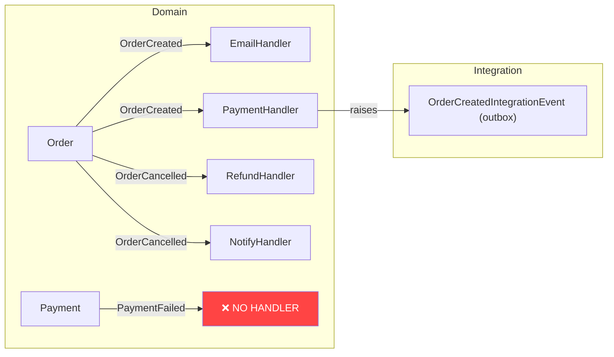

# Domain Event Map

## Core Principles

1. **Discovery before mapping** — Find all events first (grep), then find publishers, then find consumers. Build the full picture before producing output.
2. **Flag orphaned events immediately** — An event raised by an aggregate with no registered handler is almost always a bug. Highlight these prominently.
3. **Layer violations are as important as missing handlers** — Handlers registered directly in Infrastructure (bypassing Application) break the architecture. Flag these.
4. **Circular flows can cause infinite loops** — If Event A triggers Handler B which raises Event C which triggers a handler that raises Event A, you have a potential infinite loop. Detect and warn.
5. **Integration events cross module/service boundaries** — Distinguish domain events (in-process, MediatR) from integration events (cross-service, message bus). Map both but label the boundary clearly.

## Patterns

### Event Discovery by Type

```csharp
// Domain events implement IDomainEvent or INotification
public sealed record OrderCreatedDomainEvent(OrderId OrderId) : IDomainEvent;
public sealed record OrderCancelledDomainEvent(OrderId OrderId, string Reason) : IDomainEvent;

// Integration events cross service boundaries
public sealed record OrderCreatedIntegrationEvent(Guid OrderId) : IIntegrationEvent;
```

```bash
# Find domain event definitions
grep -rn "IDomainEvent\|INotification" src/ --include="*.cs" -l

# Find integration event definitions
grep -rn "IIntegrationEvent\|IntegrationEvent" src/ --include="*.cs" -l
```

### Publisher Discovery

```bash
# Find where events are raised
grep -rn "RaiseDomainEvent\|AddDomainEvent\|Publish\|Raise" src/ --include="*.cs"
```

Map the raising context:
```
Order.Create()      → raises → OrderCreatedDomainEvent
Order.Cancel()      → raises → OrderCancelledDomainEvent
Order.Ship()        → raises → OrderShippedDomainEvent
```

### Handler Discovery

```bash
# Find all domain event handlers
grep -rn "INotificationHandler\|IDomainEventHandler\|IEventHandler" src/ --include="*.cs"
```

Map the consumption:
```
OrderCreatedDomainEvent → handled by:
  - SendOrderConfirmationEmailHandler (Application)
  - CreateInitialPaymentHandler (Application)
  - OrderCreatedIntegrationEventPublisher (Infrastructure → outbox)

OrderCancelledDomainEvent → handled by:
  - RefundPaymentHandler (Application)
  - NotifyCustomerHandler (Application)
```

### Text Table Output Format

```
Domain Event Flow — {project} — {date}
=======================================

OrderCreatedDomainEvent
  Raised by:    Order.Create() [Domain/Orders/Order.cs:45]
  Handlers:
    ✅ SendOrderConfirmationEmailHandler  (Application)
    ✅ CreateInitialPaymentHandler        (Application)
    ✅ OrderCreatedIntegrationEventPublisher (Infrastructure → outbox)

OrderCancelledDomainEvent
  Raised by:    Order.Cancel() [Domain/Orders/Order.cs:78]
  Handlers:
    ✅ RefundPaymentHandler   (Application)
    ✅ NotifyCustomerHandler  (Application)

PaymentFailedDomainEvent
  Raised by:    Payment.Fail() [Domain/Payments/Payment.cs:34]
  Handlers:
    ❌ NONE — event raised but no handler registered (potential bug)

WARNINGS:
  ⚠ PaymentFailedDomainEvent has no handlers
  ⚠ Circular flow detected: OrderCreated → CreatePayment → PaymentCreated → Order.Confirm → OrderConfirmed → ...
```

### Mermaid Diagram Output



### Filtering by Aggregate

```bash
# Filter to just the Order aggregate's events
# /domain-event-map --aggregate Order

# Search only for events raised by the Order class
grep -rn "RaiseDomainEvent\|AddDomainEvent" src/ --include="*.cs" | grep -i "Order"
```

## Anti-patterns

### Mapping Only Direct Domain Events

```
// BAD — stops at domain events, misses the integration event bridge
OrderCreatedDomainEvent
  Handled by: OrderCreatedIntegrationEventPublisher ← shows it exists, stops here

// GOOD — follows the chain across the boundary
OrderCreatedDomainEvent
  Handled by: OrderCreatedIntegrationEventPublisher (Infrastructure → outbox)
    → publishes → OrderCreatedIntegrationEvent (message bus)
      → consumed by → NotificationService (external)
      → consumed by → AnalyticsService (external)
```

### Ignoring Layer Violations

```csharp
// BAD — handler in Infrastructure directly consuming a domain event
// Infrastructure/Payments/PaymentCreatedHandler.cs
public class PaymentCreatedHandler : INotificationHandler<PaymentCreatedDomainEvent>
{
    // ← This handler should be in Application, not Infrastructure
}

// This is a layer violation — map it AND flag it:
PaymentCreatedDomainEvent
  ⚠ WARNING: PaymentCreatedHandler registered in Infrastructure layer
  (handlers should be in Application)
```

### Not Flagging Zero-Handler Events

```
// BAD — shows the event but treats 0 handlers as normal
InventoryReservedDomainEvent
  Handlers: (none)

// GOOD — explicitly flags it as likely wrong
InventoryReservedDomainEvent
  ❌ NO HANDLERS — event is raised but nothing consumes it.
  Was this handler deleted? Was it moved to a different module?
  Check git log for recent changes to INotificationHandler<InventoryReservedDomainEvent>
```

## Decision Guide

| Scenario | Action |
|----------|--------|
| Default invocation | Text table: all events, publishers, handlers |
| `--mermaid` flag | Output Mermaid `graph LR` diagram instead |
| `--json` flag | Output structured JSON for tooling/import |
| `--aggregate Name` | Filter to events raised by that aggregate only |
| `--missing` flag | Show only events with no handlers |
| Event with no handlers | Flag prominently as ❌ — likely a bug |
| Handler in Infrastructure layer | Flag as ⚠ layer violation |
| Integration event bridge found | Show as separate layer with clear boundary label |
| Circular event flow detected | Flag as ⚠ — potential infinite loop |
| Large codebase (50+ events) | Default to `--aggregate` filtering or `--missing` first |

## Execution

You are executing the /domain-event-map command. Map domain events and their consumers.

### Step 1 — Discover Domain Events
Search for event definitions:
```bash
grep -rn "IDomainEvent\|INotification" src/ --include="*.cs" -l
```
Read each file to extract event names and their containing aggregate.

### Step 2 — Find Event Publishers
For each event, find where it's raised:
```bash
grep -rn "RaiseDomainEvent\|AddDomainEvent\|Publish\|Raise" src/ --include="*.cs"
```
Map: `Aggregate.Method → raises → EventName`

### Step 3 — Find Event Handlers
```bash
grep -rn "INotificationHandler\|IDomainEventHandler\|IEventHandler" src/ --include="*.cs"
```
Map: `EventName → handled by → HandlerName`

### Step 4 — Find Integration Event Bridges
```bash
grep -rn "IIntegrationEvent\|IntegrationEvent" src/ --include="*.cs"
```
Identify where domain events are transformed into integration events (cross-module or external).

### Step 5 — Generate Output
Produce text table by default. Add Mermaid diagram if `--mermaid` flag is present.

### Warnings to Surface
- Events raised but no handlers registered → likely missing handler
- Events with handlers in Infrastructure directly (should go through Application)
- Circular event flows (A raises B which raises A)

$ARGUMENTS
