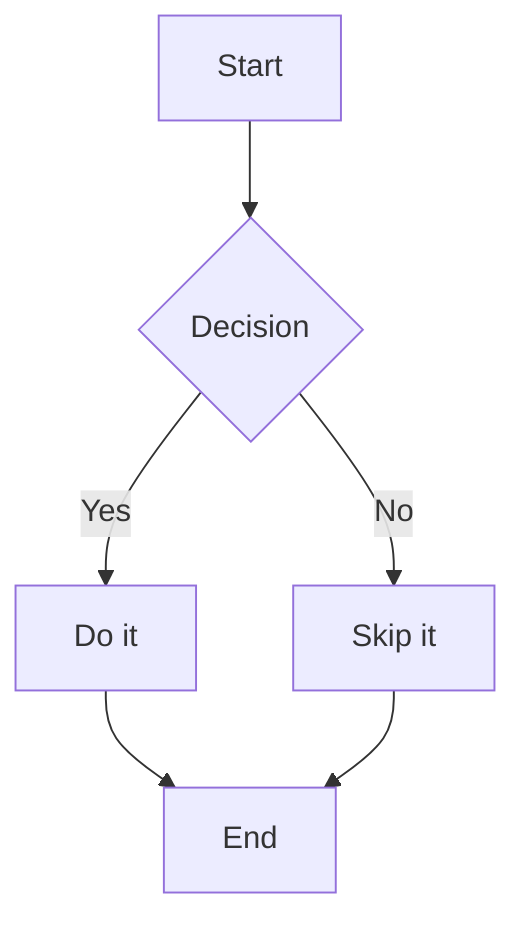
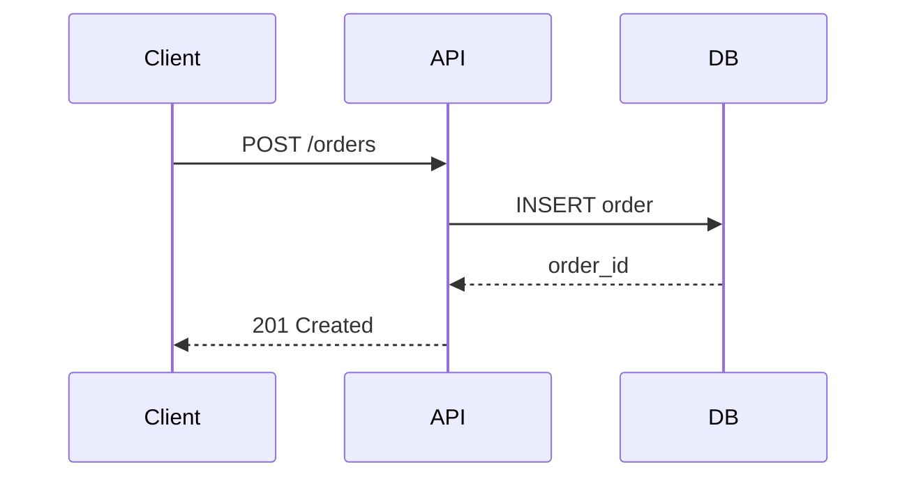
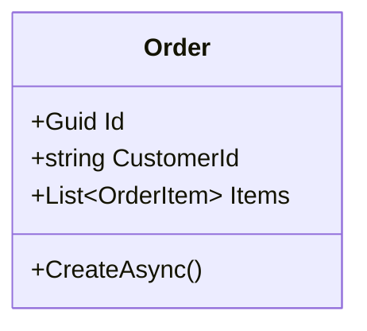

# Obsidian Flavored Markdown Reference

> Quick reference for Obsidian-specific Markdown extensions used by obsidian-kit skills.

## Links and References

### Wikilinks

```markdown
[[Note Title]]                      → link to a note by title
[[Note Title|Display Text]]         → link with custom display text
[[Folder/Note Title]]               → link to a note in a subfolder
[[Note Title#Heading]]              → link to a specific heading
[[Note Title#^block-id]]            → link to a specific block
```

### Embeds (transclusion)

```markdown
![[Note Title]]                     → embed entire note
![[Note Title#Heading]]             → embed from heading to next heading
![[Note Title#^block-id]]           → embed a specific block
![[image.png]]                      → embed image
![[image.png|300]]                  → embed image with width
```

### External Links

```markdown
[Display Text](https://example.com)
[Display Text](https://example.com "Tooltip text")
```

---

## Properties (YAML Frontmatter)

Obsidian properties are YAML frontmatter at the top of a note.

```yaml
---
title: My Note
date: 2026-04-05
tags:
  - dev
  - architecture
status: draft
project: "[[My Project]]"
related:
  - "[[Related Note 1]]"
  - "[[Related Note 2]]"
---
```

### Standard property types

| Property | Type | Example |
|----------|------|---------|
| `title` | text | `"My Note Title"` |
| `date` | date | `2026-04-05` |
| `tags` | list | `[dev, architecture]` |
| `aliases` | list | `["Alt Name", "Short Name"]` |
| `cssclasses` | list | `[wide-page]` |
| `publish` | boolean | `true` |

### Date/datetime formats

```yaml
date: 2026-04-05
datetime: 2026-04-05T14:30:00
```

---

## Callouts

```markdown
> [!NOTE]
> This is a note callout.

> [!TIP]
> Useful tip here.

> [!WARNING]
> Something to be careful about.

> [!DANGER]
> Critical issue.

> [!INFO]
> Informational.

> [!SUCCESS] Custom Title
> Custom titled callout.

> [!QUESTION]- Collapsible (closed by default)
> Content hidden until expanded.

> [!EXAMPLE]+ Collapsible (open by default)
> Content visible but collapsible.
```

### Callout types reference

| Type | Icon | Use for |
|------|------|---------|
| `note` | pencil | General notes |
| `tip` / `hint` | flame | Tips and tricks |
| `warning` / `caution` | warning | Cautions |
| `danger` / `error` | danger | Critical issues |
| `info` | info | Information |
| `success` / `check` | check | Completed items |
| `question` / `faq` | question | Open questions |
| `example` | list | Examples |
| `quote` / `cite` | quote | Quotations |
| `abstract` / `summary` | clipboard | Summaries |
| `todo` | checkbox | Action items |
| `bug` | bug | Known bugs |

---

## Tasks and Checkboxes

```markdown
- [ ] Unchecked task
- [x] Completed task
- [/] In progress (partial)
- [-] Cancelled
- [>] Forwarded/deferred
- [!] Important
- [?] Question
```

---

## Tags

```markdown
#tag                                 → simple tag
#parent/child                        → nested tag
#multi-word-tag                      → hyphenated (no spaces)
```

Tags in frontmatter:
```yaml
tags:
  - dev/architecture
  - status/draft
```

---

## Block References

```markdown
This is a paragraph. ^my-block-id

- List item one ^list-item-1
- List item two

> Quote block ^quote-block
```

Reference with:
```markdown
See [[Note Title#^my-block-id]] for details.
```

---

## Mermaid Diagrams

Obsidian renders Mermaid diagrams natively:

````markdown





````

---

## Math (LaTeX)

```markdown
Inline: $E = mc^2$

Block:
$$
\sum_{i=1}^{n} x_i = \frac{n(n+1)}{2}
$$
```

---

## Tables

```markdown
| Column 1 | Column 2 | Column 3 |
|----------|----------|----------|
| Row 1    | Value    | Value    |
| Row 2    | Value    | Value    |

<!-- Left/center/right alignment -->
| Left | Center | Right |
|:-----|:------:|------:|
| L    |   C    |     R |
```

---

## Dataview (plugin)

If the Dataview plugin is installed, use inline queries in notes:

````markdown
```dataview
TABLE date, status, project
FROM #dev
WHERE status != "done"
SORT date DESC
```

```dataview
LIST
FROM [[My Project]]
```

Inline: `= this.date`
````

---

## File Naming Conventions (obsidian-kit)

| Note type | Convention | Example |
|-----------|-----------|---------|
| Dev session | `YYYY-MM-DD {description}` | `2026-04-05 order-validation session` |
| Project | `{project-name}` | `order-service` |
| Architecture note | `{topic} - Architecture` | `CQRS - Architecture` |
| Decision | `ADR-{n} {title}` | `ADR-001 Use Result Pattern` |
| Reference | `{tool/concept} Reference` | `EF Core Reference` |

---

## Folder Structure (recommended)

```
Vault/
├── Dev/                         ← OBSIDIAN_DEV_FOLDER
│   ├── Sessions/                ← daily dev journal entries
│   ├── References/              ← quick reference notes
│   └── Snippets/                ← reusable code snippets
├── Projects/                    ← OBSIDIAN_PROJECTS_FOLDER
│   ├── {project-name}/
│   │   ├── index.md             ← project overview
│   │   ├── decisions.md         ← architecture decisions
│   │   └── sessions.md          ← session log (appended by wrap-up-ritual)
├── Areas/                       ← ongoing areas of focus
│   ├── Learning/
│   └── Planning/
└── Resources/                   ← reference material, clippings
    ├── Books/
    └── Articles/
```
